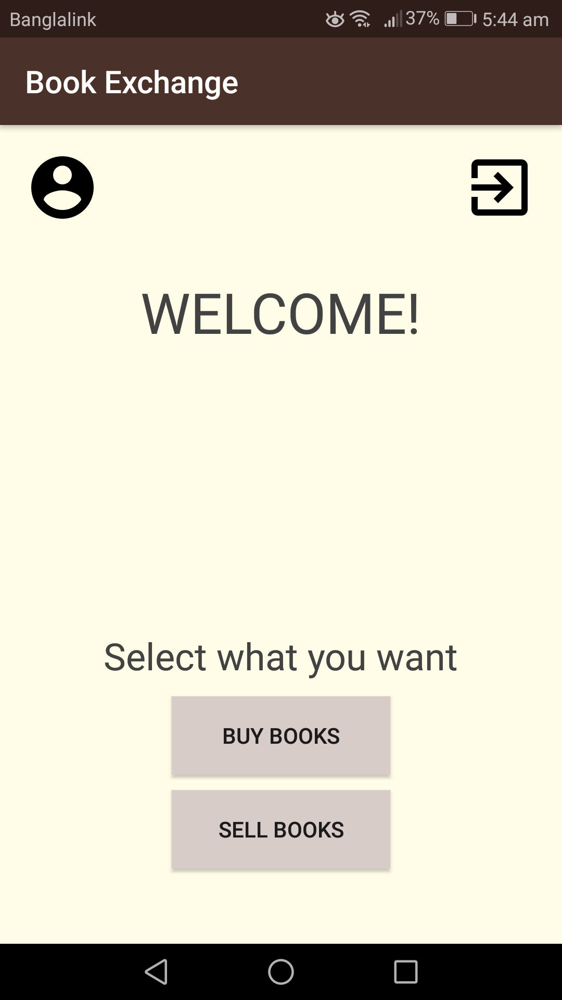
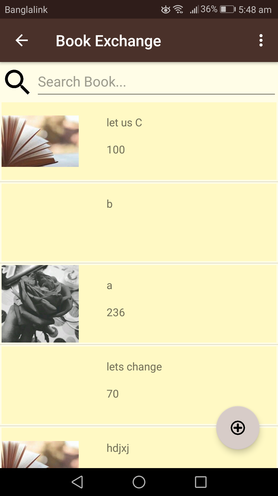
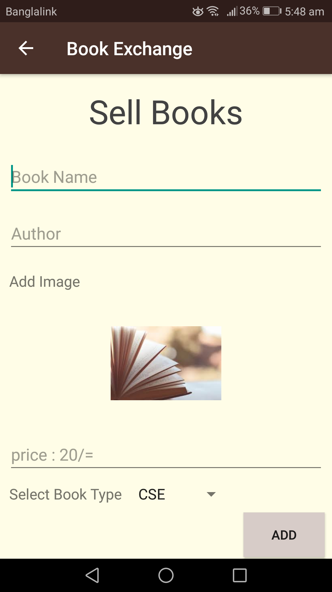
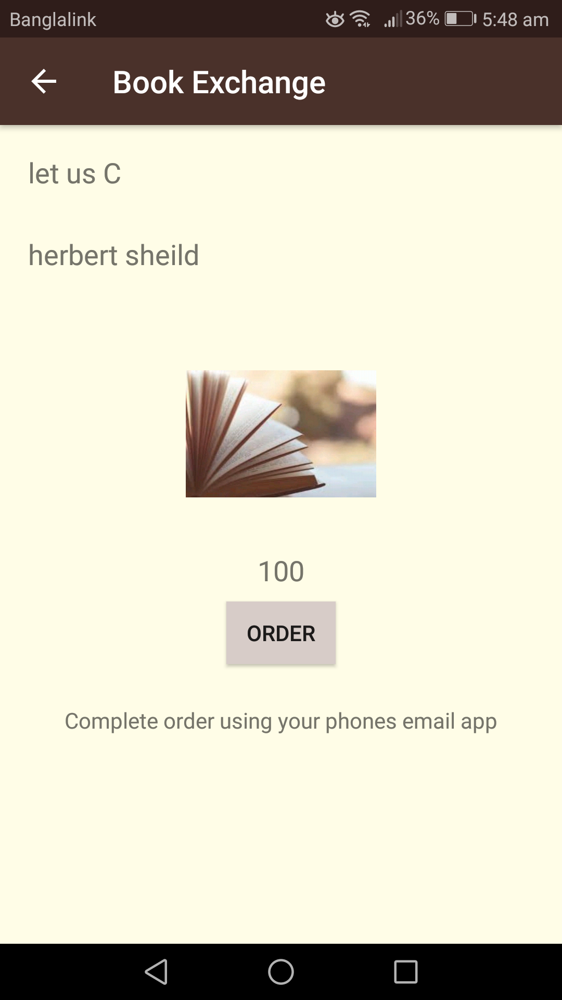
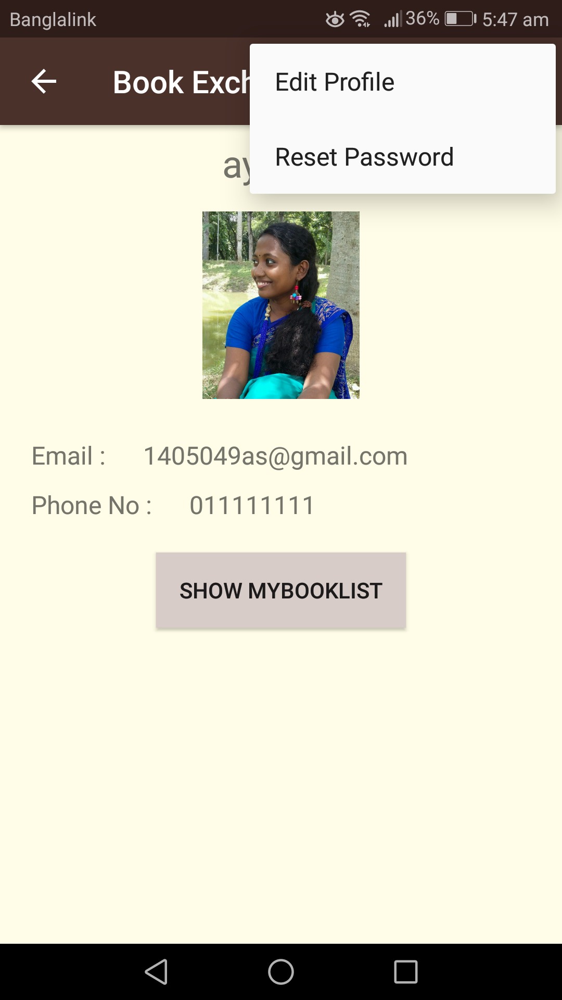

# Book Exchange
## An Android bookstore app

A basic bookstore app being developed in collaboration with the Learn IT, Girl mentorship program. The resource's planning folder includes the class diagram in addition to the UI / UX wireframes and ERD diagram.

__Student__: Ayesha Siddiqua (@Ayesha049)

__Mentor__: Jeanna Clark (@asclepiusgal)

## _Skills learned and implemented_

- Java
- Git
- Android: 
    - multi-screen activity
    - XML layouts
    - sqliteDatabase
    - unit testing
    - firebase

*** 

# _UI screenshots_

- 
- 
- 
- 
- 
- 

## _Sources_

- [Learn IT Girl program](https://www.learnitgirl.com/)
- [Google Android Development Guidelines](https://developer.android.com/develop/index.html)
- [Google Material Design Guidelines](https://material.io/guidelines/)
- [Balsamiq wireframe tool](https://balsamiq.com/)
- [Draw.io diagramming tool](https://www.draw.io/)
- [Genymotion Android emulator](https://www.genymotion.com/)
- [BOI.jpg source](https://www.pexels.com/photo/blurred-book-book-pages-literature-46274/)

***

(c) November 2017
